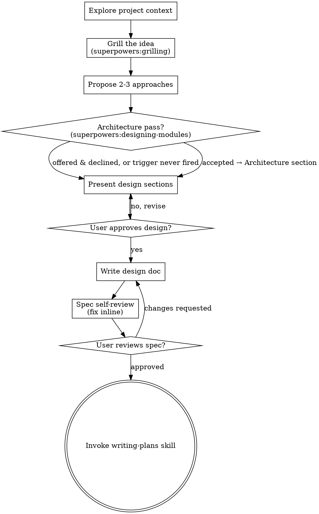

# Brainstorming Ideas Into Designs

Help turn ideas into fully formed designs and specs through natural collaborative dialogue.

Start by understanding the current project context, then refine the idea through `superpowers:grilling`'s round-by-round interview. Once you understand what you're building, present the design and get user approval.

<HARD-GATE>
Do NOT invoke any implementation skill, write any code, scaffold any project, or take any implementation action until you have presented a design and the user has approved it. This applies to EVERY project regardless of perceived simplicity.
</HARD-GATE>

## Anti-Pattern: "This Is Too Simple To Need A Design"

Every project goes through this process. A todo list, a single-function utility, a config change — all of them. "Simple" projects are where unexamined assumptions cause the most wasted work. The design can be short (a few sentences for truly simple projects), but you MUST present it and get approval.

## Checklist

You MUST create a task for each of these items and complete them in order:

1. **Explore project context** — check files, docs, recent commits
2. **Offer the visual companion just-in-time** — NOT upfront. The first time a question would genuinely be clearer shown than described, offer it then (its own message); on approval its browser tab opens for you. If no visual question ever arises, never offer it. See the Visual Companion section below.
3. **Grill the idea** — invoke `superpowers:grilling` to interview down the decision tree (relentless round-by-round Q&A with recommended answers, challenge against CONTEXT.md/ADRs, capture resolved terms/decisions inline). Resume here with the resolved design.
   - If a resolved design hinges on a question discussion can't settle, `superpowers:prototype` may be invoked as a throwaway, subagent-isolated probe (it does not bypass the HARD-GATE — see prototype guardrails).
4. **Propose 2-3 approaches** — with trade-offs and your recommendation
5. **Architecture pass (optional)** — once the approach is chosen, if it introduces 2+ new modules or lands in an existing codebase with seams it has to fit, offer `superpowers:designing-modules` in its own message. If neither holds, never mention it. It returns a module/interface/seam structure that becomes the design's Architecture section. See the Architecture Pass section below.
6. **Present design** — in sections scaled to their complexity, get user approval after each section
7. **Write design doc** — save to `docs/superpowers/specs/YYYY-MM-DD-<topic>-design.md` and commit
8. **Spec self-review** — quick inline check for placeholders, contradictions, ambiguity, scope (see below)
9. **User reviews written spec** — ask user to review the spec file before proceeding
10. **Transition to implementation** — invoke writing-plans skill to create implementation plan

## Process Flow

**The terminal state is invoking writing-plans.** Do NOT invoke frontend-design, mcp-builder, or any other implementation skill. The ONLY skill you invoke after brainstorming is writing-plans.

## The Process

**Understanding the idea:**

- Check out the current project state first (files, docs, recent commits)
- Before asking detailed questions, assess scope: if the request describes multiple independent subsystems (e.g., "build a platform with chat, file storage, billing, and analytics"), flag this immediately. Don't spend questions refining details of a project that needs to be decomposed first.
- If the project is too large for a single spec, help the user decompose into sub-projects: what are the independent pieces, how do they relate, what order should they be built? Then brainstorm the first sub-project through the normal design flow. Each sub-project gets its own spec → plan → implementation cycle.
- For a genuinely multi-feature initiative, persist the decomposition as a **PRD umbrella** at `docs/superpowers/prds/YYYY-MM-DD-<initiative>.md` — problem statement, success criteria, and the feature list with build order. Synthesize it from the grilling already done; do NOT re-interview. Then brainstorm feature 1 through the normal spec→plan flow; each feature references the PRD. Single-feature work skips the PRD entirely (the spec's purpose section covers requirements).
- Run the interview via `superpowers:grilling` (see Checklist item 3); resume once the decision tree is resolved.

**Exploring approaches:**

- Propose 2-3 different approaches with trade-offs
- Present options conversationally with your recommendation and reasoning
- Lead with your recommended option and explain why
- YAGNI ruthlessly - remove unnecessary features from every approach and design

**Presenting the design:**

- Once you believe you understand what you're building, present the design
- Scale each section to its complexity: a few sentences if straightforward, up to 200-300 words if nuanced
- Ask after each section whether it looks right so far
- Cover: architecture, components, data flow, error handling, testing
- Be ready to go back and clarify if something doesn't make sense

**Design for isolation and clarity:**

- Break the system into smaller units that each have one clear purpose, communicate through well-defined interfaces, and can be understood and tested independently
- For each unit, you should be able to answer: what does it do, how do you use it, and what does it depend on?
- Can someone understand what a unit does without reading its internals? Can you change the internals without breaking consumers? If not, the boundaries need work.
- Smaller, well-bounded units are also easier for you to work with - you reason better about code you can hold in context at once, and your edits are more reliable when files are focused. When a file grows large, that's often a signal that it's doing too much.

**Working in existing codebases:**

- Explore the current structure before proposing changes. Follow existing patterns.
- Where existing code has problems that affect the work (e.g., a file that's grown too large, unclear boundaries, tangled responsibilities), include targeted improvements as part of the design - the way a good developer improves code they're working in.
- Don't propose unrelated refactoring. Stay focused on what serves the current goal.

## After the Design

**Documentation:**

- Write the validated design (spec) to `docs/superpowers/specs/YYYY-MM-DD-<topic>-design.md`
  - (User preferences for spec location override this default)
- Use elements-of-style:writing-clearly-and-concisely skill if available
- Commit the design document to git

**Spec Self-Review:**
After writing the spec document, look at it with fresh eyes:

1. **Placeholder scan:** Any "TBD", "TODO", incomplete sections, or vague requirements? Fix them.
2. **Internal consistency:** Do any sections contradict each other? Does the architecture match the feature descriptions?
3. **Scope check:** Is this focused enough for a single implementation plan, or does it need decomposition?
4. **Ambiguity check:** Could any requirement be interpreted two different ways? If so, pick one and make it explicit.

Fix any issues inline. No need to re-review — just fix and move on.

**User Review Gate:**
After the spec review loop passes, ask the user to review the written spec before proceeding:

> "Spec written and committed to `<path>`. Please review it and let me know if you want to make any changes before we start writing out the implementation plan."

Wait for the user's response. If they request changes, make them and re-run the spec review loop. Only proceed once the user approves.

**Implementation:**

- Invoke the writing-plans skill to create a detailed implementation plan
- Do NOT invoke any other skill. writing-plans is the next step.

## Architecture Pass

`superpowers:designing-modules` works out module structure, interfaces and
seams. Like the visual companion, it is a tool, not a mode — offering it does
not commit the rest of the design to architecture-speak.

**When to offer.** After the approach is chosen (checklist item 4), when either
is true:

- the design introduces **2+ new modules**, or
- it lands in an **existing codebase with seams it has to fit**.

If neither holds, never mention it. A single-function utility does not need a
seam analysis.

**The offer is its own message.** Only the offer — no clarifying question, no
summary alongside it:

> "Before I write this up — want me to do an architecture pass first? I'd work
> out the module structure, what each interface hides, and where the seams go,
> and it becomes the Architecture section of the spec. Worth it here because
> \<reason\>; skip it if you'd rather I just write the design."

**Fill in `\<reason\>` with the specific coupling or seam that fired the trigger** — "this adds four new modules that all touch the session store," not "it seems complex," and not a bare module count. Naming what actually couples is what stops the offer degrading into a reflex on every brainstorm. If you cannot name one, the trigger did not fire: don't offer.

If they decline, continue and don't offer again unless they raise it.

**Don't stack offers.** Never offer this in the message immediately after a visual-companion offer — wait until the user has replied to something else first. And never put two out-of-band yes/no questions to the user before the design is presented. Two offers back to back read as nagging, and the second gets a reflex "no" that has nothing to do with its merits.

**Why after the approach, not before.** Approaches are usually product-level —
"SSE vs polling." Designing modules for three still-live approaches costs three
times as much and discards two thirds of it.

**What comes back.** A module/interface/seam table for the chosen approach. It
becomes the Architecture section of the design you present at item 6 and of the
spec you write at item 7. If the visual companion is already running, its
structure diagram belongs in the browser tab; otherwise Mermaid in the spec.

## Visual Companion

A browser-based companion for showing mockups, diagrams, and visual options during brainstorming. Available as a tool — not a mode. Accepting the companion means it's available for questions that benefit from visual treatment; it does NOT mean every question goes through the browser.

**Offering the companion (just-in-time):** Do NOT offer it upfront. Wait until a question would genuinely be clearer shown than told — a real mockup / layout / diagram question, not merely a UI *topic*. The first time that happens, offer it then, as its own message:
> "This next part might be easier if I show you — I can put together mockups, diagrams, and comparisons in a browser tab as we go. It's still new and can be token-intensive. Want me to? I'll open it for you."

**This offer MUST be its own message.** Only the offer — no clarifying question, summary, or other content. Wait for the user's response. If they accept, start the server with `--open` so their browser opens to the first screen automatically. If they decline, continue text-only and don't offer again unless they raise it.

**Per-question decision:** Even after the user accepts, decide FOR EACH QUESTION whether to use the browser or the terminal. The test: **would the user understand this better by seeing it than reading it?**

- **Use the browser** for content that IS visual — mockups, wireframes, layout comparisons, architecture diagrams, side-by-side visual designs
- **Use the terminal** for content that is text — requirements questions, conceptual choices, tradeoff lists, A/B/C/D text options, scope decisions

A question about a UI topic is not automatically a visual question. "What does personality mean in this context?" is a conceptual question — use the terminal. "Which wizard layout works better?" is a visual question — use the browser.

If they agree to the companion, read the detailed guide before proceeding:
`skills/brainstorming/visual-companion.md`
